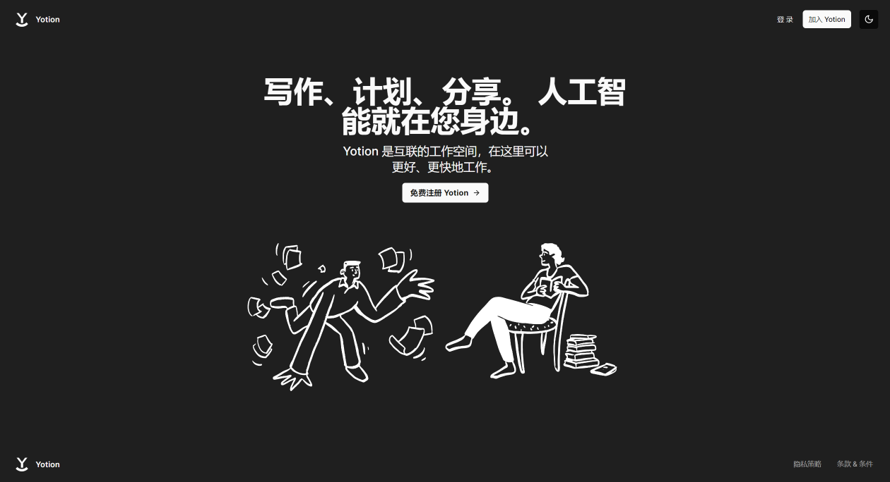
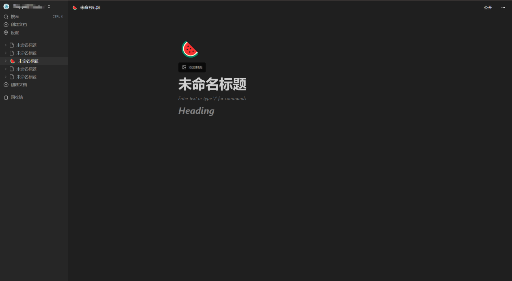

## <div align=center>Yotion</div>
<div align=center>
<p >

    
 


</p>
</div>

一个基于React + Next.js搭建的全栈笔记平台，轻松记录你的学习工作中的笔记。朋友也能够通过您的分享连接对您的笔记进行访问。

[在线Demo](https://yinp.cc/)

### <div style='padding:8px 0; border-bottom:2px solid #eee'>✨特性</div>
- 🌓暗黑模式
- 📱响应式能力
- :globe_with_meridians:笔记公开发布
- 🔒支持第三方登陆
- 📋Markdown语法支持
- 💎优雅美观
### <div style='padding:8px 0; border-bottom:2px solid #eee'>🖼️预览图</div>




### <div style='padding:8px 0; border-bottom:2px solid #eee'>🎈使用</div>

[Convex](https://www.convex.dev/)
[Convex配置官方文档](https://docs.convex.dev/quickstart/nextjs)
[Clerk第三方登陆验证](https://docs.convex.dev/auth/clerk)

```js
npm run dev
npx convex dev
```

### <div style='padding:8px 0; border-bottom:2px solid #eee'>🛜部署</div>

[Vercel官方网站]()
[Convex使用Vercel部署](https://docs.convex.dev/production/hosting/vercel)


